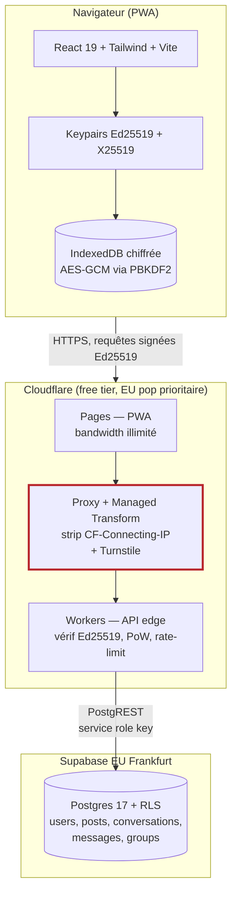
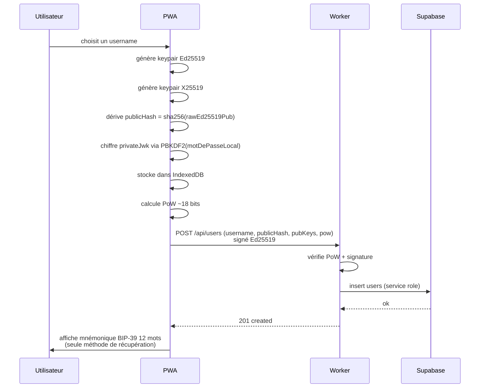
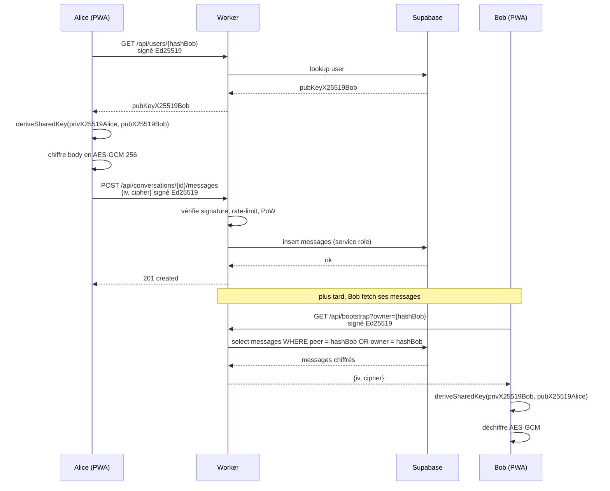

# Ghostinator — Architecture technique

> Réseau social fantôme. Anonymisation totale par construction, budget de démarrage quasi nul, équipe sans admin sys. Document de référence aligné avec le code livré le 2026-05-07.

**Auteurs :** Artus, Vitrice
**Date :** 2026-05-07
**Version :** 1.0 — MVP

---

## 1. Cap fonctionnel

| Acteur | Ce qu'il fait |
|---|---|
| Utilisateur lambda | Crée une identité anonyme. Poste. Lit le feed public. Envoie/reçoit des DM E2EE. Crée et rejoint des groupes chiffrés. |
| Modérateur communautaire (post-MVP) | Voit le contenu signalé (sans voir le hash de l'auteur), masque ou laisse. |
| Légal (jamais en lecture en prod) | Reçoit, sur réquisition, le contenu public déjà publié et l'historique d'actions par hash de pubkey. Rien d'autre. |

### Story critique

> En tant qu'utilisateur, je veux créer une identité anonyme dans mon navigateur, envoyer un message chiffré bout-en-bout à un autre utilisateur identifié par son hash de clé publique, et le recevoir chiffré, sans que le serveur puisse jamais lire le contenu.

C'est cette story qui doit tourner pour la démo. Tout le reste (feed, groupes, signalements, modération) découle de cette mécanique d'auth + E2EE.

---

## 2. Schéma d'architecture



**Ce que représente la frontière rouge (`PROXY`) :** c'est *là* que l'IP du client disparaît définitivement. Côté Cloudflare le header `CF-Connecting-IP` est strippé par Managed Transform, et le Worker vérifie défensivement qu'il n'arrive jamais. Aucun log applicatif n'a accès à l'IP.

---

## 3. Stack et versions

| Couche | Choix | Version | Justification |
|---|---|---|---|
| Frontend | React + Vite + Tailwind | React 19, Vite 7, Tailwind 3.4 | PWA installable, écosystème moderne. |
| Crypto navigateur | WebCrypto natif | Spec WebCrypto Curve25519 | Ed25519 + X25519 sans bibliothèque externe. |
| Edge | Cloudflare Workers | compatibility_date 2026-05-07 | V8 isolates, < 1 ms cold start, 100k req/jour gratuits. |
| API dev fallback | Express + Node | Express 5, Node 20 | Permet de développer en local sans wrangler. Même API que le Worker. |
| BDD | Supabase Postgres | Postgres 17, Supavisor inclus | RLS native, Realtime WebSocket, 500 MB free, EU Frankfurt. |
| Hosting frontend | Cloudflare Pages | — | Bandwidth illimité, build sur push. |
| Anti-bot | Cloudflare Turnstile | — | Sans cookie, RGPD by design, illimité gratuit. |
| Runtime de dev | Bun | 1.x | Installation des deps, scripts. |
| Runtime CI | GitHub Actions | ubuntu-latest | < 5 min, free tier. |
| Lang | TypeScript | 5.9 strict | Sécurité de typage. |

Modèle de données complet : `supabase/schema.sql`. Validation côté API : `server/index.js` (Express) et `worker/src/index.js` (Worker), helpers dupliqués volontairement (`requireUsername`, `requireHash`, `encryptedPayload`).

---

## 4. Modèle de données (logique, simplifié)

```
users (
  id uuid pk,
  username citext unique 2-32,
  public_hash text unique 64 hex,        -- sha256(rawEd25519PubKey)
  public_key_ed25519 text 256,           -- raw 32 octets en base64
  public_key_x25519 text 256,            -- raw 32 octets en base64
  created_at timestamptz
)

posts (
  id uuid pk,
  author_username citext,
  author_hash text 64 hex,
  body text 280,
  replies int >= 0,
  created_at timestamptz
)

conversations (
  id uuid pk,
  owner_hash text 64 hex,
  peer_hash text 64 hex,
  peer_username citext,
  peer_public_key_x25519 text 256,
  unique (owner_hash, peer_hash),
  created_at timestamptz
)

messages (
  id uuid pk,
  conversation_id uuid fk -> conversations on delete cascade,
  author_hash text 64 hex,
  author_username citext,
  iv text 200,                           -- IV AES-GCM en base64
  cipher text 10000,                     -- ciphertext en base64
  created_at timestamptz
)

groups (
  id uuid pk,
  owner_hash text 64 hex,
  owner_username citext,
  name text 80,
  topic text 180,
  intro_iv text 200,
  intro_cipher text 10000,
  member_count int >= 1,
  created_at timestamptz
)
```

**Invariant fort :** le serveur n'a *jamais* de clé qui permet de déchiffrer `messages.cipher` ou `groups.intro_cipher`. Une fuite complète de la base de données ne révèle pas le contenu des DM ni des intros de groupe.

---

## 5. Flux principaux

### 5.1 Création d'identité (onboarding)



### 5.2 Envoi d'un DM E2EE



---

## 6. Sécurité

### 6.1 Confidentialité

- **Anonymisation** : pas de PII collectée, IP strippée à l'edge, identifiants = hash de pubkey. Voir ADR-0002.
- **Confidentialité des DM** : E2EE X25519 ECDH + AES-GCM 256. Le serveur ne voit que `{iv, cipher}`.
- **Confidentialité des intros de groupe** : AES-GCM 256, clé symétrique générée localement et stockée en IndexedDB. Pas de partage de clé groupe entre clients dans le MVP — limite assumée.

### 6.2 Intégrité et authentification

- **Signature Ed25519 par requête** : header `X-Signature: <timestamp>.<signature_b64>` qui couvre `<method>.<path>.<timestamp>.<sha256(body)>`. Replay protection par timestamp (60 s de marge).
- **RLS Postgres** : politiques publiques en `select` sur `users`/`posts`/`groups`, écritures uniquement via service role qui passe par le Worker (qui vérifie la signature en amont). Voir ADR-0004.

### 6.3 Anti-abus

- **Proof-of-Work Hashcash** : ~18 bits (~200 ms CPU smartphone) à la création de compte, ~14 bits (~50 ms) à la création de post. Inscrit dans `X-PoW: <nonce>.<hash>`.
- **Rate-limit hashé** : `hash(pubkey + jour + secret_rotatif_serveur)` côté Worker. Compte sans identifier. Secret rotatif quotidien dans `wrangler secret`.
- **Turnstile** : widget Cloudflare sur signup et création de post, sans cookie ni fingerprint.

### 6.4 Headers HTTP de sécurité

Configurés dans Cloudflare Pages `_headers` et dans le Worker :

```
Content-Security-Policy: default-src 'self'; script-src 'self'; style-src 'self' 'unsafe-inline'; connect-src 'self' https://*.workers.dev; img-src 'self' data:; frame-ancestors 'none'; base-uri 'self'; form-action 'self'
Strict-Transport-Security: max-age=63072000; includeSubDomains; preload
X-Frame-Options: DENY
X-Content-Type-Options: nosniff
Referrer-Policy: no-referrer
Permissions-Policy: camera=(), microphone=(), geolocation=(), interest-cohort=()
```

CORS strict côté Worker : whitelist `["https://ghostinator.pages.dev", "http://127.0.0.1:5173"]` (en dev).

### 6.5 OWASP Top 10 — état pour Ghostinator

| OWASP 2021 | Statut |
|---|---|
| A01 Broken Access Control | RLS Postgres + signature Ed25519 par requête. Couvert. |
| A02 Cryptographic Failures | WebCrypto standards, pas de crypto maison. Couvert. |
| A03 Injection | PostgREST + paramètres typés Supabase. Couvert. RLS comme défense en profondeur. |
| A04 Insecure Design | ADR explicites pour les décisions structurantes. Couvert. |
| A05 Security Misconfiguration | Headers HTTP durcis, CORS strict, Turnstile. Couvert. |
| A06 Vulnerable Components | `bun pm audit` en CI (à brancher), Renovate prévu post-MVP. Partiel. |
| A07 Auth Failures | Pas de mot de passe — clé privée locale + Ed25519. Pas de session. Couvert. |
| A08 Data Integrity Failures | Build Vite reproductible, déploiement signé via wrangler. Partiel — pas de signature SLSA. |
| A09 Logging & Monitoring | Cloudflare Web Analytics + logs Worker JSON. Pas d'alerting branché en MVP — dette. |
| A10 SSRF | Aucun appel sortant côté serveur depuis du contenu utilisateur. Couvert. |

---

## 7. Observabilité

- **Logs** : `console.log` JSON structuré côté Worker, capturés dans Cloudflare Logs (rétention 24 h en free, qu'on accepte). Format type :
  ```json
  {"ts":"2026-05-07T14:23:01Z","level":"info","service":"ghostinator-worker","trace_id":"...","msg":"post created","author_hash_prefix":"7f3c9a","status":201}
  ```
- **Métriques RED** : pas branchées dans le MVP. Dette explicite — à brancher sur Grafana Cloud free tier en M+1 (10k séries actives gratuites).
- **Analytics** : Cloudflare Web Analytics (cookieless, pas d'IP, pas de fingerprint). Branche en M+1.
- **Pas de Sentry.** GlitchTip self-hosted prévu sur le VPS du plan B avec scrubbing PII agressif. Pas en MVP.

---

## 8. Sauvegarde et restauration

| Donnée | RPO cible | RTO cible | Stratégie |
|---|---|---|---|
| Postgres Supabase | 24 h | 4 h | Backup quotidien Supabase (rétention 7 j en free, 30 j en Pro). En post-MVP : `pg_dump | rclone scaleway:backups/` nightly out-of-band. |
| Médias R2 (post-MVP) | — | — | R2 réplique automatique Cloudflare. À l'activation du plan B : copie périodique vers Backblaze B2 via Bandwidth Alliance. |
| Code | 0 | minutes | Git, déploiement reproductible via `wrangler deploy`. |

**Test de restauration :** prévu en M+1 du lancement (cf. `docs/presentation/ghost-social-plan-b.md` §M2). *Une sauvegarde non testée est de l'espoir, pas une sauvegarde.*

---

## 9. Stratégie de déploiement

| Environnement | Cible | Comment |
|---|---|---|
| **Local** | dev | `bun run dev` lance Express + Vite via `concurrently`. Mode JSON file ou Supabase selon `.env`. |
| **Staging** | preview Pages + Worker dev | Push sur branche feat/* déclenche CF Pages preview + `wrangler deploy --env staging`. |
| **Prod** | Pages production + Worker prod | Push sur `main` après PR mergée. CI verte exigée avant merge. Tag `vX.Y` recommandé. |

CI minimum (GitHub Actions, `.github/workflows/ci.yml`) : install bun, type-check TS, lint, build Vite, tests unitaires Vitest, test E2E story critique. < 5 min. Free tier.

---

## 10. Stratégie de scalabilité

Voir ADR-0004 §Stratégie de scale. Synthèse :

| Palier | Goulet | Action | Coût |
|---|---|---|---|
| 0 → 10k MAU | aucun | rien | 0 € |
| 10k → 50k MAU | Postgres 500 MB | Supabase Pro 8 GB + archivage cold posts > 6 mois R2 Parquet | 25 $/mois |
| 50k → 500k MAU | Workers 100k req/j | Workers Paid | 5 $ + 0,30 $/M req |
| 500k → 5M MAU | writes Postgres | partitionnement par `author_hash` premier hex | ~200 $/mois |
| 5M+ MAU | sharding | Citus ou CockroachDB | discuter avec investisseur |

**Chaque palier est un changement de plan, pas une réécriture applicative.**

---

## 11. Limites assumées (ce qu'on a choisi de ne pas faire)

| Sujet | Raison |
|---|---|
| Pas de récupération de compte côté serveur | Toute procédure de récupération serveur ouvrirait un backdoor d'identification. Mnémonique BIP-39 = seule récupération, locale. |
| Pas de DM groupe E2EE multi-parties | Les groupes utilisent une clé symétrique stockée localement chez le créateur. Pas de partage de clé entre clients dans le MVP — limite explicite. Ajout en M+1 via Signal Protocol Sender Keys ou MLS. |
| Pas de notifications push | Push exigerait un endpoint stable côté navigateur, ce qui ré-introduit un identifiant corrélable. Choix d'attendre un mécanisme push anonyme (Web Push avec endpoint éphémère). |
| Pas d'app mobile native | PWA suffit. Pas d'App Store = pas de compte Google/Apple lié. |
| Pas de modération ML | Coût compute incompatible avec free tier. Modération communautaire seule. |
| Pas de monitoring out-of-band en MVP | Dette explicite à payer en M+1 (UptimeRobot + Telegram + GlitchTip). |
| Pas d'IaC Terraform en MVP | Dette explicite. À écrire si le plan B est activé. |

---

## 12. Sources et références

- ADR-0001 : Vendor lock-in Cloudflare vs vitesse de delivery — `docs/adr/0001-vendor-lock-in-cloudflare.md`
- ADR-0002 : Anonymisation totale et auditabilité légale — `docs/adr/0002-anonymisation-auditabilite.md`
- ADR-0003 : Auth Ed25519 client-side — `docs/adr/0003-auth-ed25519-client-side.md`
- ADR-0004 : Supabase Postgres + RLS — `docs/adr/0004-supabase-postgres-rls.md`
- Plan B Cloudflare quitte l'EEE : `docs/presentation/ghost-social-plan-b.md`
- Pitch oral 5 min : `docs/presentation/ghost-social-pitch.md`
- Glossaire : `docs/presentation/ghost-social-glossaire.md`
- Schéma Excalidraw : `docs/presentation/ghost-social-architecture.excalidraw`
